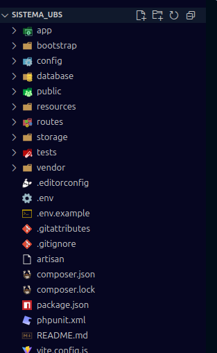
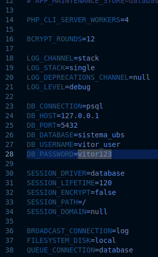

# 10/17/2025

- The next step is to continue preparing the development environment.

## Permissions and user

- Apache places the project files by default in /var/www/html.

- For now, development will be done in that folder and its permissions will be adjusted.

```bash
# make your user the owner and group of the folder (owner:group)
sudo chown -R $USER:$USER /var/www/html

# change permissions for owner, group and others
# 7 (owner) -> read, write and execute
# 5 (group) -> read and execute
# 5 (others) -> read and execute
sudo chmod -R 755 /var/www/html
```

## Composer and Laravel

- Next, install Composer, which is required to install PHP dependencies and to create the Laravel project.

```bash
# install composer
sudo apt install -y composer

# test composer
composer --version
```

- Then create the Laravel project and finally start editing the project for use. Here is the project creation via terminal:

```bash
# change to the directory where Apache serves files
cd /var/www/html

# create the laravel project in /var/www/html/sistema_ubs
composer create-project laravel/laravel sistema_ubs

# change group permissions (laravel)
# give write permission to the group on /storage and /bootstrap/cache
sudo chmod -R 775 /var/www/html/sistema_ubs/storage
sudo chmod -R 775 /var/www/html/sistema_ubs/bootstrap/cache
```

## Editing with VS Code

- Finally editing the project via IDE.

```bash
# open project in VS Code
code /var/www/html/sistema_ubs
```

- Example of the initial/default project configuration:
<p align="left">
  
</p>

- Enter the `.env` file and modify the database lines:

<p align="left">
  
</p>

- Now just run and test the local domain (http://localhost:8000 or http://127.0.0.1:8000)

```bash
# artisan (laravel) opens a test server for the site
php artisan serve
```

- P.S.: in some cases it is necessary to start the test server before opening the project in VS Code (personal experience).
